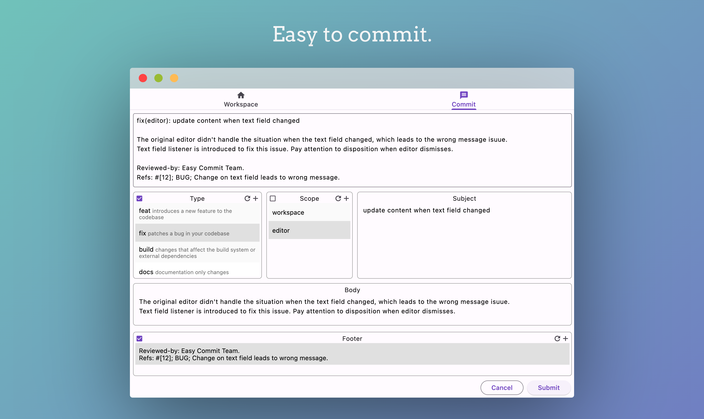

##

  
  

   
  

  <h1 align="center"><b>Easy Commit</b></h1>
  

  Easy to perfrom conventional git commits
     
    <a href="https://github.com/0renlyhuang/EasyCommit/releases"><strong>Install »</strong></a>
     
  

# What is Easy Commit?

Easy Commit is a cross-plaform desktop app which makes it easy to perfrom conventional git commits. It provides the ablilty to hook when git commit occurs, and helps to fill commit message field such as type, scope, subject, body and footer.

Easy Commit is avaliable on MacOS, Windows and Linux since it is building with Flutter. Life is short. Integrate Easy Commit into your git workflow.

# What is Conventional Commits?
Conventional Commits is a specification for adding human and machine readable meaning to commit messages. 

For more detail, please refer [Conventional Commits](https://www.conventionalcommits.org/en/v1.0.0/).

# Set up workspace
Easy commit works based on the mechanism of git hooks.

There're two ways to set up a workspace in Easy Commit app:
1. Click select file button under workspace tab to specify `.git/hooks/commit-msg` file or `.git/hooks/commit-msg.sample` file.
2. Click select folder button under workspace tab to specify `.git/hooks` folder.

- Press `cmd + shit + .` to show hidden files on MacOS if needed.

After setting up, Easy Commit will be automatically launched when ` git commit -m "xxx" ` executed.

# Support
If you have any problems you can open an issue on this repository.

# License
Easy Commit is distributed under [MIT License](/LICENSE).
